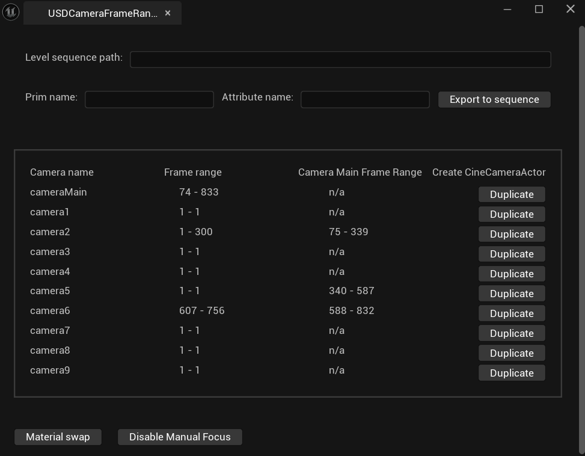
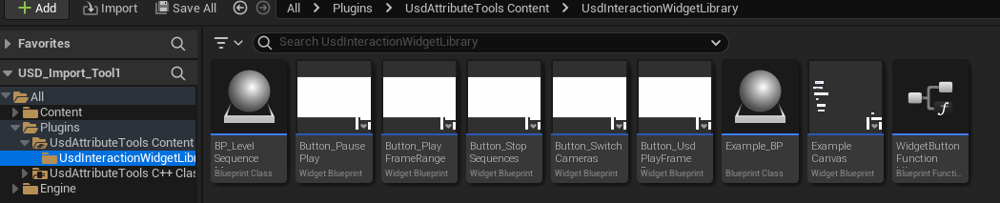

# Unreal Engine USD Attribute Tools plugin

## Overview

Designed for Proto Imaging to assist in their pipeline from Maya to Unreal Engine, this project aims to fill some of the gaps in functionality for USD in Unreal Engine.

This plugin is split into three sections. The "UsdCameraFrameRanges" module is an editor module that is opened from the window tab, and displays the camera information from the cameras found within the found USD file. Additionally it provides access to USD attributes, an automatic material swap based on the Usd material name and an automatic disable manual focus button for all cameras in the level for editor purposes.

The "UsdAttributeFunctionLibrary" module provides a selection of blueprint callable functions to directly access USD attribute values at runtime. This covers integers, floats, doubles and Vec3 for all of those too. This is for both static and time sampled values.

Within the plugin content, there is a selection of button widgets to provide access to the level sequences, or automatically access a Usd sequence. These buttons, and pause/play and stop buttons all use the Widget Button Function library, which is a collection of functions that control the level sequence player. To share the same level sequence player, this calls to a blueprint holding a level sequence player as a variable.

## Installation

This plugin is built in windows for Unreal Engine 5.4.2, so it is suggested to use within a 5.4 version. In your Unreal project, the USD Importer must first be installed for this plugin to work. Go to Edit -> Plugins and search for USD.

  To install this plugin, clone the repository or download the and unzip the zip file. The contents of the plugin should appear in a folder called UE-UsdAttributeTool-main. This contents of this folder should be moved into a folder called UsdAttributeTools, as this is the name of the plugin that will be recognised by Unreal Engine. Navigate to your project directory. Here, if there is a Plugins directory, move the plugin into this directory. To rebuild the project files, click on the .uproject file, which should display a popup saying "The following modules haven't been installed or have been built in a different version". Click rebuild, and the project should rebuild with the plugin installed.

### UsdCameraFrameRanges

The UsdCameraFrameRanges module provides an editor tool window, providing insight into the frame ranges from USD cameras, as well as access to other USD related tools. This can be found under "Window", at the bottom of the menu below Enable Fullscreen. Built for Proto imaging, this requires a UsdStageActor to be present in the scene, and is designed to display the frame ranges of animation for each camera, and the ranges that they are present on the cameraMain's cameraNumber attribute. This is by Proto's design where they use a main camera in Maya to control camera cuts.

The user can enter the path to a level sequence, found by copying the reference to the level sequence asset, into the text box at the top. Then by clicking one of the duplicate buttons, that USD camera will be duplicated into a native Unreal CineCameraActor, with the animation being baked into the level sequence. Animated USD attribute values can also be exported onto a level sequence with this approach. The Prim name and Attribute name must be entered, and after clicking Export to sequence the values for this animated attribute will be added to the sequence. This feature is currently only supported for float attributes.

The material swap button swaps the USD shaders for the objects on the stage, for Unreal Materials that have the same name. For this to work, the name of the Shader on the USD and the Unreal Material must be the same. Any Unreal Materials to be read here, must be in the /Game/Materials folder in the content browser. Once clicked, the generated components of the assets with matching material names will have their materials swapped for their Unreal Material match.

### UsdAttributeFunctionLibrary

The UsdAttributeFunctionLibrary provides a set of blueprint callable functions, allowing USD Attributes to be accessed at runtime. In any editor, search for Get Usd Attribute, and the options for the supported types and their animated counterparts should appear. Requiring the UsdStageActor as a parameter, these functions will find the entered prim's attribute value and output it. Care must be taken to ensure that the correct type is used.

### Widget Button Function Library

The Widget Button Function Library, and the rest of the USD Interaction Button Library can be found in the content browser. Under plugins, there should appear the content for this plugin. Running off of the functions in the Widget Button Function Library, this provides the Play Frame Range node, which is how the corresponding buttons work. The functions in the library can be called from any blueprint. In order for these to work, one instance of the BP_LevelSequencePlayerManager must be present in the level, as this will ensure that any level sequences set off by the buttons are synchronised, so that they resource conflicts don't take place.

To use the buttons, in a widget blueprint editor, look under the User Created and scroll down to find the following options: 

